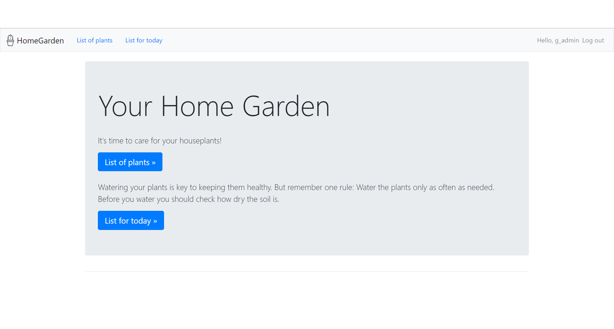
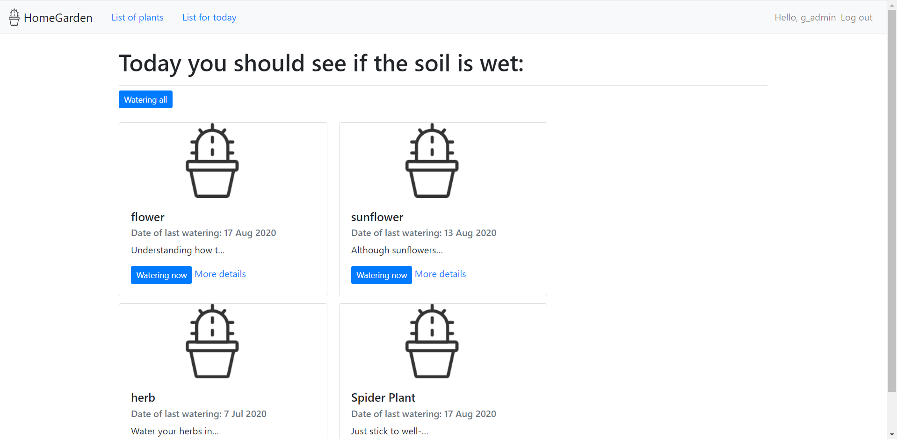

# HomeGarden - django website
> This is a simple app for assuring that each of your houseplant is watered properly.

## Table of contents
* [Motivation](#motivation)
* [Screenshots](#screenshots)
* [Technologies](#technologies)
* [Setup](#setup)
* [Features](#features)

## Motivation
This is my first django project created to learn the technology. Based on online tutorials and book ‘Python Crash Course’ by Eric Matthews.

## Screenshots

## Technologies
* Django - version 3.0.9
* Bootstrap 4

## Setup
* Run the command `git clone https://github.com/KasiaCzy/garden.git ` to have this repository locally in your computer
* Change into the new directory
* Run the command `python manage.py runserver` to run the app on a local server
* Open your web browser and enter the address of your local server (usually its http://127.0.0.1:8000 )

## Features
* Create cards for plants: add a photo of your plant, give it a name, identify its watering frequency and
add a note with some useful information if you want to.
* Check daily watering reminders list to keep your plants well.
* Check plant's date of last watering.